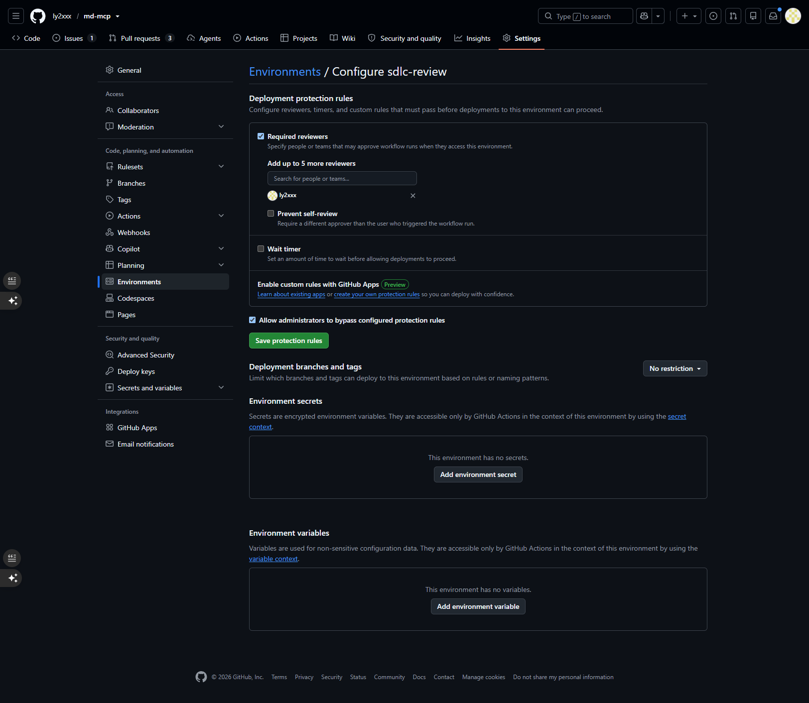
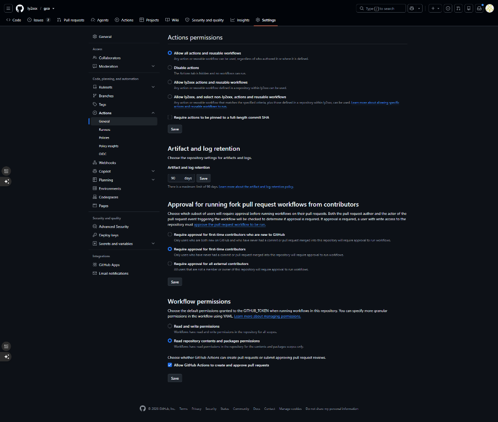
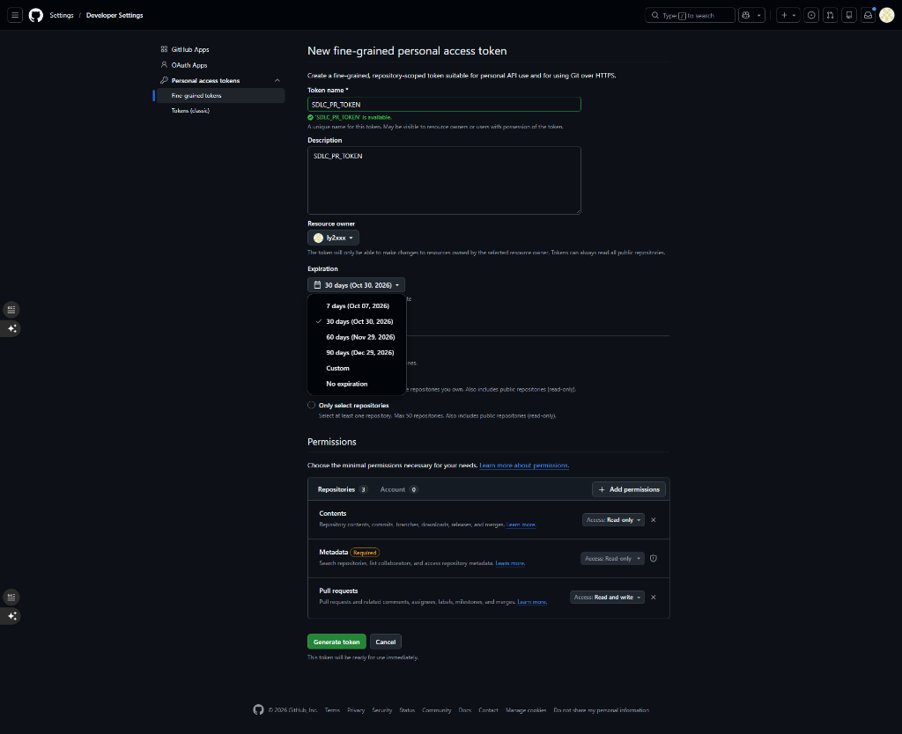

# AI-native SDLC pipeline

One GitHub Actions run takes a feature from a one-line idea to a pull request.
Ollama Cloud writes the design, a builder writes the code, and deterministic
checks decide whether it is done. `sdlc.yml` and `sdlc-phase.yml` here are
reusable workflows: a repository calls them from its own two workflow files
(see [the README](../../README.md#use-it)), and
[`actions/sdlc-stage`](../../actions/sdlc-stage/README.md) does the work.

```text
Actions → SDLC Pipeline → Run workflow (idea), or an issue labelled "sdlc"      one run, one line
  1 · Ollama writes intent.md → ✋ → 2 · spec.md → ✋ → 3 · plan.md → ✋
  4 · ⏸ Hand off and wait for the build     tags sdlc/<feature>/approved, then waits
        the builder: Claude Code (builder=claude) or a person (builder=human)
        for each phase: phase/<feature>/<n> → PR into feature/<feature> → SDLC Phase Check → merge
        when build-log.md logs every phase, the same run carries on:
  5 · Verify the build + 5 · Security scan → 5 · Ollama reviews the build → 6 · ✋ Open the pull request
```

Everything lands on one branch, `feature/<feature>`, in `sdlc/features/<feature>/`
(the `features-dir` input).
The ✋ jobs wait on the `sdlc-review` environment, so the run pauses at each one
until you approve. Waiting there uses no runner minutes. Step 4 doesn't use a
gate: it is a job that polls the feature branch for up to `build-wait-minutes`
(three hours by default) after you approve the plan.

## Setup (once, in the calling repository)

1. **Turn on HITL approval (Settings → Environments):**
   - Click **New environment** and name it `sdlc-review`:

     
   - Under **Deployment protection rules**, check **Required reviewers** and add yourself as a reviewer. Leave **Prevent self-review** unchecked (so you can approve runs triggered by your own actions), then click **Save protection rules**:

     
2. **Settings → Actions → General → Allow GitHub Actions to create and approve pull requests**, or add an `SDLC_PR_TOKEN` secret:
   - **Option A (Workflow permissions):** In **Settings → Actions → General**, under **Workflow permissions**, check **Allow GitHub Actions to create and approve pull requests** and click **Save**:

     
   - **Option B (`SDLC_PR_TOKEN` secret):** Create a fine-grained personal access token (under user **Settings → Developer Settings → Personal access tokens → Fine-grained tokens**) with repository permissions for **Pull requests: Read and write** and **Contents: Read-only** (or write), then add it as a repository secret named `SDLC_PR_TOKEN` under **Settings → Secrets and variables → Actions**:

     

     With the token, CI also runs on the PR. With neither, step 6 fails but prints the pull request's title and body in its log, so it can be opened by hand.
3. `OLLAMA_API_KEY` secret. Optional variables: `OLLAMA_MODEL` (empty uses the
   default in [`actions/defaults.env`](../../actions/defaults.env)) and
   `OLLAMA_THINK` (`false` stops a reasoning model thinking for minutes).
4. For issue starts, an `sdlc` label. Only people with triage or write access
   can add it, so outside issues can't start a run.

## Languages

Verification sets the repository up from the files at its top level
([`actions/project-env`](../../actions/project-env/action.yml)), and the plan stage
describes the same setup to the model, so plans use the repository's own tools:

| The repository has | Verification gets |
| :-- | :-- |
| `pyproject.toml`, `requirements.txt` or `setup.py` | Python (`python-version`) in a `.venv` on `PATH`, the project (`pyproject.toml`, else `requirements.txt`, plus `requirements-dev.txt`) and pytest. |
| `package.json` | Node.js (`node-version`, else `.nvmrc` or `.node-version`, else the latest LTS) and the dependencies: `npm ci` with `package-lock.json`; pnpm, installed from npm at the version `packageManager` pins (else the latest), with `pnpm-lock.yaml`; yarn through corepack with `yarn.lock`; otherwise `npm install`. |
| both | Both. |
| neither | Python with only pytest. |

`test-command` defaults to `python -m pytest -q`, so a Node.js repository sets it,
for example to `npm test`. Whatever it runs must exit non-zero when it finds no
tests: pytest, Jest and Vitest do by default, and `--passWithNoTests` turns that
off. For a subproject (a `package.json` below the root) or another language the
runner image provides, set `install-command` and `test-command`; the install runs
after the toolchains are set up. Pin pnpm with `packageManager` in `package.json`:
a newer pnpm than the one that wrote the lockfile can refuse it.

## Run a feature

1. **Start.** Run **SDLC Pipeline** with an idea and a builder, or open an issue
   labelled `sdlc` whose title is the idea.
2. **At each ✋ Review job**, open the run. The job before it shows the new
   document in its summary with **View** and **Edit on the branch** links. Edit
   it there if it needs changing, then **Review deployments → Approve**. The next
   stage reads the branch after you approve, so it sees your edits. **Reject**
   stops the run.
3. **Build, while step 4 waits.** Step 4 freezes the approved documents as the
   `sdlc/<feature>/approved` tag, lists the phases in its summary, and waits.
   - *A coding agent* such as Claude Code works from the same hand-off as a
     person: the plan's phases and its "Hand back" section. It can also start
     runs by opening `sdlc` issues, if it can't start workflows.
   - *A person:* follow the hand-off summary. Build each phase, run the local
     check it prints, and push, either straight to `feature/<feature>` or through
     `phase/<feature>/<n>` pull requests, which get the Phase check. Add a
     `## Phase <n>: ...` section to `build-log.md` for each phase; the plan's
     "Hand back" section says what goes in it.
4. **Carry on.** When `build-log.md` logs every phase, step 4 finishes and the
   same run verifies the whole branch and has Ollama review the diff against
   the spec. **6 · ✋ Open the pull request** pauses so you can read the
   verification report and the review, then opens the pull request into the
   base branch (the repository's default branch unless `base` says otherwise).
   If step 4 stopped waiting first, run it again with the feature and start
   `build`.

| Run workflow with         | Does                                                                                                                      |
| :------------------------ | :------------------------------------------------------------------------------------------------------------------------ |
| idea                      | a new feature, numbered after the highest existing one                                                                    |
| idea + feature            | revises that feature's intent, then spec and plan again, and re-freezes                                                   |
| feature                   | the first missing document, or the build run if all three exist                                                           |
| feature + start           | that stage onwards: `spec` or `plan` redoes the design, `build` runs only steps 5-6                                       |
| an issue labelled `sdlc`  | the title is the idea; `feature: <name>` in the body revises that feature, and with `start: build` runs only steps 5-6 |

## What the checks hold the builder to

- **The approved plan.** Verification reads `plan.md` from the
  `sdlc/<feature>/approved` tag and fails if `intent.md`, `spec.md` or `plan.md`
  changed on the branch. A plan that can't be built gets regenerated by the plan
  stage, never edited by the builder.
- **Scope.** A changed file outside the phase's `targets`, or any `frozen` file,
  fails. `build-log.md` is the builder's own and is exempt.
- **Tests.** Each phase's Verify block and the whole suite (the caller's
  `test-command`, `python -m pytest -q` by default; see [Languages](#languages))
  must exit zero, and a suite that collects no tests fails.
- **Coverage.** The plan has a row for every "Done when" item in `intent.md`; one
  it can't deliver is marked `NOT COVERED`, for you to see at the plan review.
- **Security.** Secrets in the branch's commits, and HIGH or CRITICAL vulnerable
  dependencies (with a fix available) or misconfigurations that the base branch
  doesn't already have, fail the security scan, and the pull request waits for
  it. Findings already on the base are listed, not blocking. Accept one with
  `.gitleaksignore` or `.trivyignore`; see
  [`actions/security-scan`](../../actions/security-scan/README.md).
- **Ollama's review** of the build is advisory. It goes into the pull request.

## Guard rails

- **No model-written code runs in Actions.** The model writes documents; people
  approve them, and the builder writes the code.
- **"Tests pass" is an exit code**, from each phase's Verify block and the whole
  suite, never anyone's opinion.
- **Permissions per job.** Only the document jobs and step 4 (which pushes the
  tag) can write to the repository; verification, the review and the Phase
  check are read-only; only the last job can open a pull request.

## Known limits

- An approval comment doesn't reach the next stage. To steer a stage, edit the
  document on the branch before approving.
- The Verify commands come from the approved plan and run on the runner, so
  read them at the plan review like any other code.
